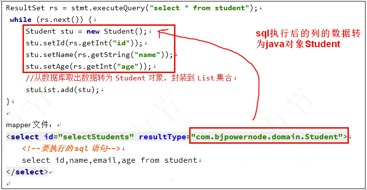
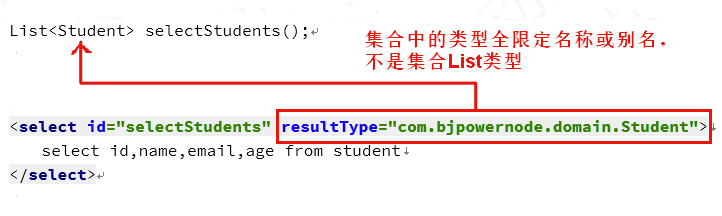

# resultType

> resultType: 执行 sql得到 ResultSet转换的 类型 ，使用类型的 完全限定名或别名。 注意如果返回的是集合，那应该设置为集合包含的类型，而不是集合本身。<br>resultType 和 resultMap，不能同时使用。



## 1. 简单类型

接口方法：

```java
int countStudent();
```

mapper文件：

```xml

<select id="countStudent" resultType="int">select count(*) from student</select>
```

测试方法：

```java
@Test
public void testRetunInt(){
        int count=studentDao.countStudent();
        System.out.println("学生总人数："+count);
        }
``` 

## 2. 对象类型

接口方法：

```java
Student selectById(int id);
```

mapper文件：

```xml

<select id="selectById" resultType="com.bjpowernode.domain.Student">
    select id,name,email,age from student where
    id=#{studentId}
</select>
```

框架的处理： 使用构造方法 创建对象 。调用 setXXX给属性赋值。

```java
Student student=new Student();
```

<table>
    <tr>
        <th>sql语句列</th>
        <th>java对象方法</th>
        <th></th>
    </tr>
    <tr>
        <td>id</td>
        <td>setId( rs.getInt(“id”) ）</td>
        <td rowspan="4">调用列名对应的 set方法<br> id列 --- setId() <br> name列 --- setName()</td>
    </tr>
    <tr>
        <td>name</td>
        <td>setName( rs.getString(“name”) )</td>
    </tr>
    <tr>
        <td>email</td>
        <td>setEmail( rs.getString(“email”) )</td>
    </tr>
    <tr>
        <td>age</td>
        <td>setAge( rs.getInt(“age”) )</td>
    </tr>
</table>

> 注意： Dao接口方法返回是集合类型，需要指定集合中的类型，不是集合本身。




## 3.Map集合
> sql的查询结果作为 Map的 key和 value。推荐使用 <code>Map<Object,Object></code>。<br>
注意： Map作为接口返回值， sql语句的查询结果最多只能有一条记录。 大于一条记录是错误。 
> 
接口方法：

```java
Map<Object, Object> selectReturnMap(int id);
```

mapper文件：

```xml

<select id="selectReturnMap" resultType="java.util.HashMap">select name,email from student where id = #{studentId}
</select>
```

测试方法：

```java
@Test public void testReturnMap(){
        Map<Object, Object> retMap=studentDao.selectReturnMap(1002);
        System.out.println("查询结果是Map:"+retMap);
        }
```
