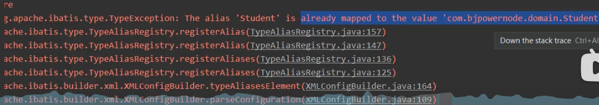

## mybatis配置<code>resultType</code>的别名-----<b><code>不推荐使用别名</code></b>

### 1.单独配置

```xml

<typeAliases>
    <!-- 一个类型，一个自定义别名
    type: 自定义类型的全限定名称
    alias:别名
    -->
    <typeAlias type="org.example.entity.Student" alias="student"></typeAlias>

</typeAliases>
```

### 2.配置整个<code>entity</code><b>package</b>

```xml

<typeAliases>
    <!--
        name 是包名，为这个包中的所有类配置别名，类名就是别名【不区分大小写】
        -->
    <package name="org.example.entity"/>
</typeAliases>
```

> 为包下的所有类配置别名会存在问题<br>
不同名 包下 有同名的类，如果这两个包都配置了所有类的别名，使用同名类的时候将会报错
> 
